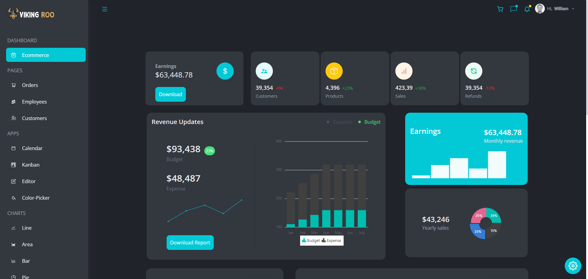
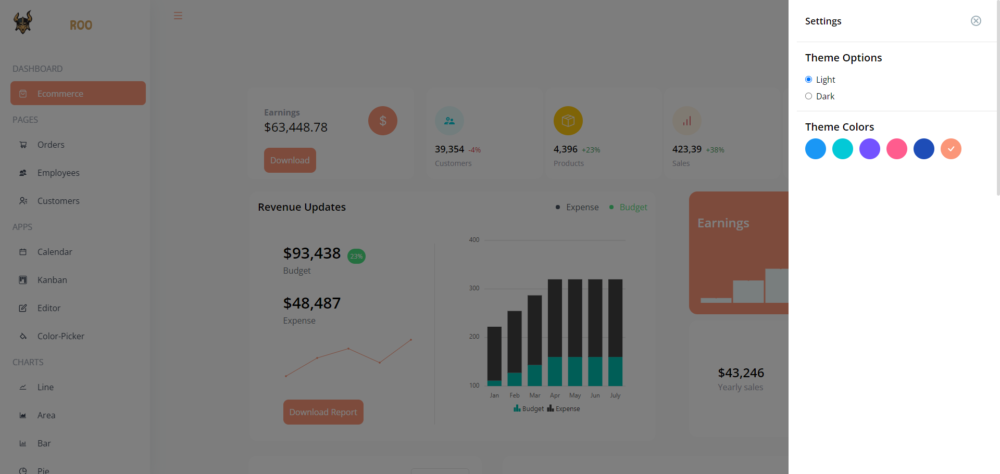
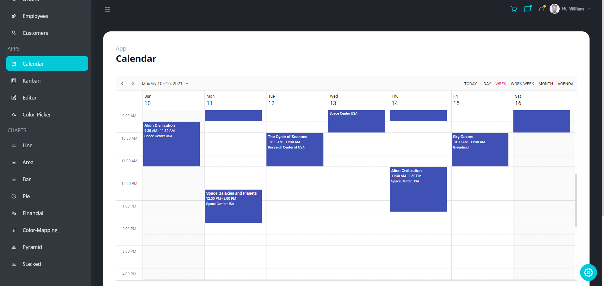
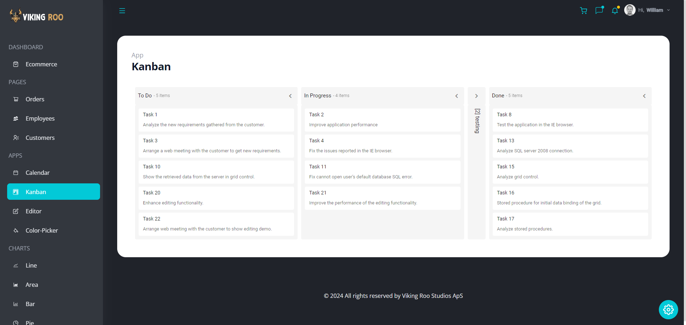
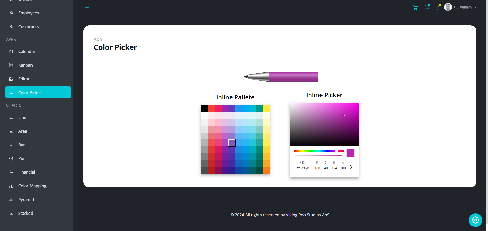
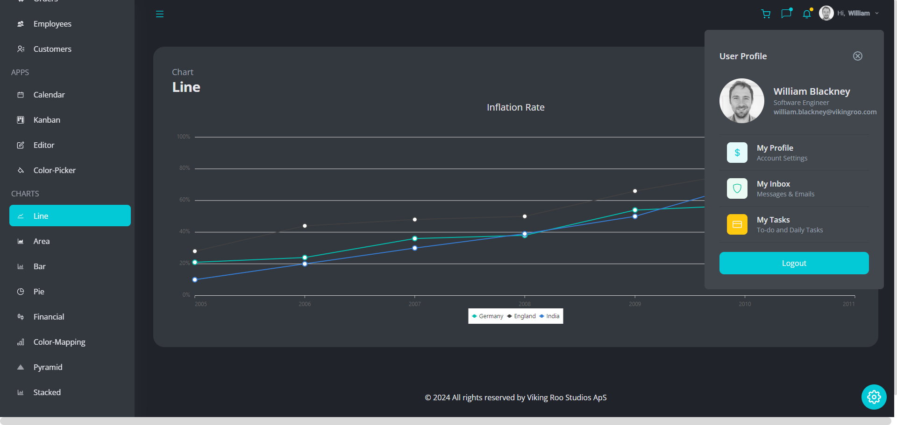
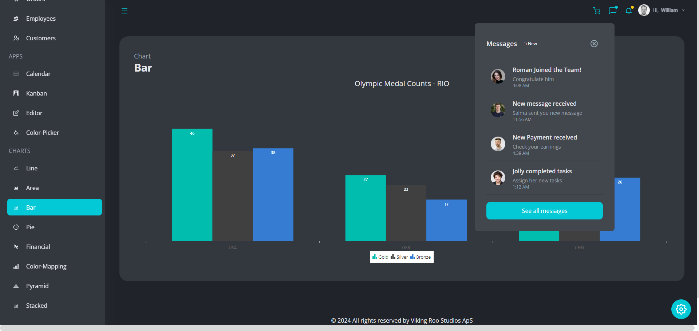

# Viking Roo Enterprise Dashboard Web App

1. 🤖 [Introduction](#introduction)
2. ⚙️ [Tech Stack](#tech-stack)
3. 🤸 [Screenshots](#screenshots)

## <a name="introduction">🤖 Introduction</a>

Viking Roo Enterprise Dashboard is a front end web app that emulates many of the features found in professional apps like <a href="https://www.atlassian.com/software/jira" target="_blank">Jira</a>, <a href="https://www.wrike.com/vaj/" target="_blank">Wrike</a> and <a href="https://www.keyedin.com/" target="_blank">KeyedIn</a>. It gives user's easy access to information about customers, staff, finances, products, orders and invoices, as well as supporting project management and company organisation with a kanban board and calendar. Business data can be displayed in many different graphs, such as a line graph, bar chart, area graph, pie chart, stock price chart, pyramid chart, and stacked bar graph. The app has a responsive design and will run on both desktop and mobile.

<a href="https://www.kooka.live" target="_blank"><b>Experience a live demo of the app here!</b></a>. 

## <a name="tech-stack">⚙️ Tech Stack</a>

- <a href="https://react.dev/" target="_blank"><b>React</b></a>. 
- <a href="https://www.syncfusion.com/" target="_blank"><b>Sync Fusion UI</b></a>. 
- <a href="https://tailwindcss.com/" target="_blank"><b>Tailwind CSS</b></a>. 

## <a name="screenshots">🤸 Screenshots</a>

### Light + Dark Mode with Color Themes

### Calendar

### Kanban Board

### Color Picker

### Line Chart

### Bar Chart

